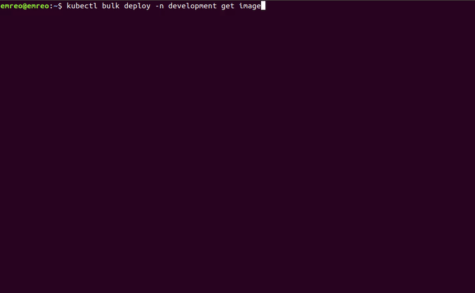
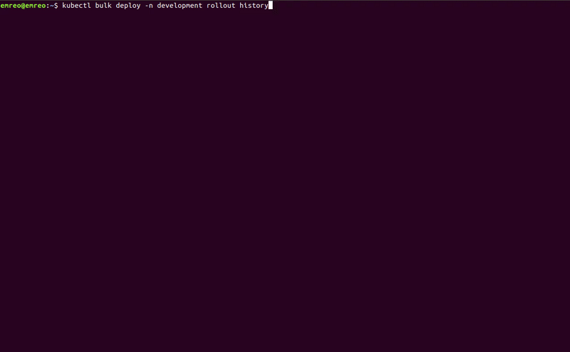

<meta name='keywords' content='kubectl, kubectl plugins, kubectl-plugins, kubectl bulk, kubectl interactive, kubectl exec, kubernetes bulk, kubernetes interactive, kubectl delete all, kubernetes delete all, kubectl edit all, kubernetes edit all '>

# kubectl bulk (aka bulk-action)

This plugin useful for Bulk operations.

You can easily do bulk operations on all resource types like deployments, services, pods etc.  
`Bulk plugin` has two part, first you select resources with bulk command, then chose your command (get,delete .. etc.) with parameters. 
 
 `kubectl bulk <get resourceTypes> (get|list|create|update|delete|remove|rollout) <command parameters>`  
 ```
 kubectl bulk deploy -n test get image   
 ```
<b> Now you can use % wild card in get resource types </b>

```
kubectl bulk deploy my-deploy% -n test update mylabel newValue
```

`Bulk plugin` has 5 main abilities for now :-)

 - `bulk .. get` gets selected fields's values for given resource types. 
 - `bulk .. list` lists all resource definitions in yaml or json.
 - `bulk .. create` creates new resource from your exist resources.
 - `bulk .. update` updates bulk resource definitions fields.
 - `bulk .. delete` delete bulk resources with delete parameters.
 - `bulk .. remove` remove bulk resource definitions fields.
 - `bulk .. rollout` rollouts given processes.  


### Details


 <details>
 <summary><b>bulk get</b></summary>
 
 `bulk .. get` automatically get resources name, you don't need to add for all command 
 !!Warning!! `bulk .. get` create a temporary file in path for performance.  
 
 #### Usage
  
  ``` 
   # get fields' values for given resource type
   kubectl bulk <resourceType> [<parameters>] get [<fields>]
  ``` 
  
  
 #### Sample

```console 
 $ kubectl bulk hpa -n myspace get minReplicas maxReplicas  
  minReplicas maxReplicas fields are getting
    name: podinfo
    maxReplicas: 10
    minReplicas: 2
    name: sample-metrics-app-hpa
    maxReplicas: 10
    minReplicas: 2
    
 $ kubectl bulk service get file json
 All definitions will be written in file.json
 
  ```
 </details> 
  <details>
 <summary><b>bulk list</b></summary>
 
 ##   **`bulk list`**  

`bulk .. list` default mode for `Bulk plugin`

#### Usage
 
 ``` 
  # list all resource definitions in yaml (default format) format 
  kubectl bulk <resourceType> [<parameters>]
  # list all resource definitions in json format  
  kubectl bulk <resourceType> [<parameters>] list json
  # list all resource definitions in to a file with json format  
  kubectl bulk <resourceType> [<parameters>] list filename json  
 ``` 
 
 
  #### Sample
  ```console 
$ kubectl bulk deploy -n test 
apiVersion: v1
items:
- apiVersion: extensions/v1beta1
  kind: Deployment
  name: sample-app
  ...
apiVersion: v1
items:
- apiVersion: extensions/v1beta1
  kind: Deployment
  name: another-sample-app
...
 
$ kubectl bulk service list file json
All definitions will be written in file.json

 ```
 </details> 
  <details>
 <summary><b>bulk create</b></summary>

 ###   **`bulk create`**  
`bulk .. create` get your resource definitions and change metadata fields (name,namespaces) as you defined then create the new resources.
 !!Warning!! If that parameter not found (with/out value) than nothing will be changed/created. Standard not created error will be throwed.
  
 #### Usage
 
 ``` 
# get all definitions and create resources with definitions that parameterName fields changed has oldValue with newValue
  kubectl bulk <resourceType>[<parameters>] create parameterName oldValue newValue
# get all definitions and create resources with definitions that parameterName fields removed and added with newValue
  kubectl bulk <resourceType>[<parameters>] create parameterName newValue  
 ``` 
 
 
 #### Sample
 
  ```console 
$ kubectl bulk deploy -n test create namespace test staging 
creating new resource with changing namespace: test to namespace: staging for all  deploy
deployment.extensions/sample-app created
deployment.extensions/another-sample-app created

$ kubectl bulk service create name service1 service2


 ```
</details> 
  <details>
 <summary><b>bulk update</b></summary>

 ##   **`bulk update`**  
`bulk .. update` get your resource definitions and change any fields as you defined then update resource definitions.
 !!Warning!! If that parameter not found (with/out value) than nothing will be changed/updated. Standard not updated error will be throwed.

 #### Usage
 
 ``` 
 # get all definitions and update resources with definitions that parameterName fields changed has oldValue with newValue
  kubectl bulk <resourceType>[<parameters>] update parameterName oldValue newValue
# get all definitions and update resources with definitions that parameterName fields removed and added with newValue
  kubectl bulk <resourceType>[<parameters>] update parameterName newValue  
 ``` 
 
 #### Sample
 
  ```console 
# Update all deploys image value in test namespace which image version was v1   
$ kubectl bulk deploy -n test update image v1 v2 
updating resource with changing image: v1 to image: v2 for all  deploy -n test
deployment.extensions/deploy-1 replaced
deployment.extensions/deploy-2 replaced
deployment.extensions/deploy-3 replaced
...
# Update all deploys image value in test namespace with v4
$ kubectl bulk deploy -n test update image v4 
updating resource with image: v5 for all  deploy 
deployment.extensions/deploy-1 replaced
deployment.extensions/deploy-2 replaced
deployment.extensions/deploy-3 replaced

 ```
</details> 
  <details>
 <summary><b>bulk delete</b></summary>

 ##   **`bulk delete`**  
`bulk .. delete` easy way to bulk delete resources or fields.

 #### Usage
 
 ``` 
  # delete resources that in requested resource types 
  kubectl bulk <resourceType> [<parameters>] delete
  # delete fields of resources that in requested resource types  
  kubectl bulk <resourceType> [<parameters>] delete <delete parameters>
  
 ``` 
 
 #### Sample
 
  ```console 
$ kubectl bulk service -n test delete
 service/svc-1 deleted
 service/svc-2 deleted
 ...
$ kubectl bulk deploy delete --grace-period=1
deployment.extensions/deploy-1 deleted
deployment.extensions/deploy-2 deleted

 ```
</details> 
  <details>
 <summary><b>bulk remove</b></summary>

 ##   **`bulk remove`**  
`bulk .. remove` easy way to bulk remove resource/fields.

 #### Usage
 
 ``` 
  # delete resources that in requested resource types 
  kubectl bulk <resourceType> [<parameters>] remove
  # delete fields of resources that in requested resource types  
  kubectl bulk <resourceType> [<parameters>] remove <field> <value>
  
 ``` 
 #### Sample
 
  ```console 
$ kubectl bulk service -n test remove
 service/svc-1 deleted
 service/svc-2 deleted
 ...
$ kubectl bulk deploy remove label1
deployment.extensions/deploy-1 replaced
deployment.extensions/deploy-2 replaced

 ```
</details> 
  <details>
 <summary><b>bulk rollout</b></summary>

 ##   **`bulk rollout`**  
`bulk .. rollout` gives you all rollout features that history|pause|resume|status|undo    
!!Reminder!! Rollout feature could be used only these resource types -> deployments|daemonsets|statefulsets

 #### Usage
 
 ``` 
  # do rollout for all resources that requested 
  kubectl bulk <resourceType> [<parameters>] rollout history|pause|resume|status|undo <rollout parameters>
 ``` 
 
 
 #### Sample
 
  ```console 
$ kubectl bulk deploy -n test rollout undo
 'deploy's are being rollout undo
 deployment.extensions/deploy-1
deployment.extensions/deploy-2
$  kubectl bulk deploy -n test rollout history
deployment.extensions/deploy-1 
REVISION  CHANGE-CAUSE
1         <none>

deployment.extensions/deploy-2 
REVISION  CHANGE-CAUSE
1         <none>
2         <none>

 ```
</details> 

# kubectl it ~~ interactive 
 `kubectl it` execute exec, edit, delete and log commands with interactive selection.
 
 * Port-forward ability added 
 
 `fzf` is required for this plugin.

  <details>
 <summary><b>Usage </b></summary>
 
```console
$ kubectl it
..
$ kubectl it exec|edit|log|log-follow|delete|port-forward
..
$ kubectl it exec|edit|log|log-follow|delete|port-forward <namespace>
```


   

    

        

        
   </details> 

#  [kubectl ixec](https://github.com/duyguserbest/kubectl-iexec)

kubectl plugin to simplify interactive exec command.

Lists Kubernetes objects to choose from to create kubectl exec -ti command.


`fzf` is required for this plugin. 

  <details>
 <summary><b>Usage </b></summary>


```sh
kubectl ixec
```
</details> 

# Installation 

## Install with krew
Install krew plugin manager for kubectl.
```bash
kubectl krew install bulk-action
```
## Linux

 `Kubectl-plugins` are Bash scripts, it would be work in any POSIX environment that has Bash installed. 
 sed|grep|awk are prerequisite commands for `kubectl bulk`  
`fzf` is required for `kubectl it` and `kubectl ixec`
 !!WARNING!!  Kubectl has plugin feature with version 12. Don't forget to update your kubectl installation :)

``` bash

sudo git clone https://github.com/emreodabas/kubectl-plugins /opt/kubectl-plugins
sudo ln -s /opt/kubectl-plugins/kubectl-bulk /usr/local/bin/kubectl-bulk
sudo ln -s /opt/kubectl-plugins/kubectl-ixec /usr/local/bin/kubectl-ixec
sudo ln -s /opt/kubectl-plugins/kubectl-it /usr/local/bin/kubectl-it
```

### fzf Installation

- [`Install fzf`](https://github.com/junegunn/fzf#installation)

```sh
git clone --depth 1 https://github.com/junegunn/fzf.git ~/.fzf
~/.fzf/install
```


